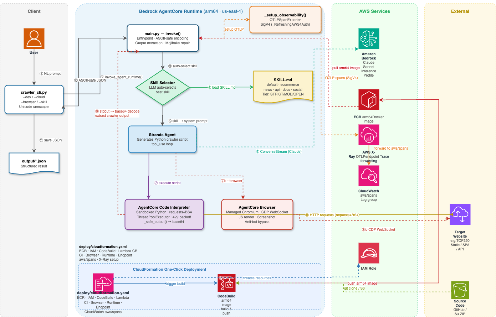

# CrawlAgentcore

> [English](#english) | [中文](#中文)

---

<a id="english"></a>

# CrawlAgentcore — Natural Language Web Crawler on AWS Bedrock AgentCore

A [Strands Agents](https://github.com/strands-agents/sdk-python) powered crawler that accepts natural-language instructions, auto-selects the best crawl strategy, and executes scraping in either **AgentCore Code Interpreter** (fast, requests-based) or **AgentCore Browser** (real managed Chromium with JS rendering and anti-bot bypass) — returning fully-structured JSON with complete CJK/Unicode support and built-in OpenTelemetry observability via AWS X-Ray.

## Table of Contents

- [Architecture](#architecture)
- [AWS Infrastructure](#aws-infrastructure)
- [Skills](#skills)
- [Browser Tool](#browser-tool)
- [Quick Start](#quick-start)
  - [Prerequisites](#prerequisites)
  - [Local Development](#local-development)
  - [Cloud Deployment](#cloud-deployment)
- [CLI Usage](#cli-usage)
- [Observability](#observability)
- [Encoding Pipeline](#encoding-pipeline)
- [Project Structure](#project-structure)
- [Configuration](#configuration)
- [Tests](#tests)
- [Troubleshooting](#troubleshooting)

---

## Architecture



---

## AWS Infrastructure

| Resource | ID / URI | Status |
|---|---|---|
| ECR Repository | `$AWS_ACCOUNT_ID.dkr.ecr.$AWS_REGION.amazonaws.com/crawler-agentcore` | — |
| AgentCore Runtime | `$AGENTCORE_RUNTIME_ID` | set via env |
| Runtime Endpoint | `$AGENTCORE_ENDPOINT_NAME` | set via env |
| Code Interpreter | `$CODE_INTERPRETER_ID` | set via env |
| AgentCore Browser | `$BROWSER_ID` | set via env |
| IAM Execution Role | `AmazonBedrockAgentCoreRuntime-<ProjectName>` | — |
| Region | `$AWS_REGION` | — |

> All resource IDs are set via environment variables — see [Configuration](#configuration) and [Cloud Deployment](#cloud-deployment).  
> Run `deploy/deploy.sh` to provision everything automatically.

**IAM Role Permissions required:**
- `bedrock:InvokeModel*` on `*` (for Claude inference profiles)
- `bedrock-agentcore:InvokeCodeInterpreter` on the Code Interpreter ARN
- `bedrock-agentcore:StartBrowserSession`, `StopBrowserSession`, `InvokeBrowser`, `UpdateBrowserStream`, `GetBrowserSession` on `arn:aws:bedrock-agentcore:*:*:browser-custom/*`
- `xray:PutTraceSegments`, `xray:PutSpansForIndexing` on `*`
- `logs:CreateLogGroup`, `logs:CreateLogDelivery`, `logs:PutLogEvents` on `arn:aws:logs:*:*:log-group:aws/spans`

**Docker image:** `linux/arm64` — AgentCore Runtime requires ARM64. Build with `docker buildx` using a `docker-container` driver (required to work around AppArmor restrictions on some Linux hosts).

---

## Skills

Six built-in crawl strategies in `skills/`. Each skill is a directory containing:
- `SKILL.md` — YAML frontmatter (name, description) + LLM instructions + `_safe_output()` helper
- `examples/sample-output.json` — reference output shape
- `reference.md` _(optional)_ — additional hints for complex sites

| Skill | Auto-selected for |
|---|---|
| `default-crawl` | General pages — titles, links, text blocks |
| `ecommerce-crawl` | Product listings, prices, availability, pagination |
| `news-crawl` | Headlines, authors, publish dates, article body |
| `api-crawl` | REST/JSON endpoints, pagination, nested resources |
| `docs-crawl` | Documentation, wikis, code blocks, heading hierarchy |
| `social-crawl` | Forums, social posts, timestamps, engagement counts |

### Concurrency & Anti-Detection Strategy

Every skill classifies the target domain into a **tier** at runtime and applies matching concurrency and request delay automatically — no manual tuning needed.

| Tier | Example sites | How it's detected |
|---|---|---|
| **STRICT** | douban.com, zhihu.com, amazon.com, jd.com, taobao.com, weibo.com | Hardcoded domain list |
| **MODERATE** | Most news / general `.com`/`.net`/`.org` not in either list | Default fallback |
| **OPEN** | books.toscrape.com, jsonplaceholder.typicode.com, docs.python.org | Hardcoded domain list |

| Skill | STRICT (workers / delay) | MODERATE (workers / delay) | OPEN (workers / delay) |
|---|---|---|---|
| `default-crawl` | 1 / 1.5–3.0 s | 1 / 0.5–1.5 s | 1 / none |
| `ecommerce-crawl` | 3 / 1.5–3.0 s | 5 / 0.3–1.0 s | 8 / none |
| `news-crawl` | 2 / 2.0–4.0 s | 4 / 0.5–1.5 s | 6 / none |
| `api-crawl` | 2 / 1.0–2.0 s | 6 / 0.1–0.5 s | 10 / none |
| `docs-crawl` | 2 / 1.5–3.0 s | 5 / 0.2–0.8 s | 8 / none |
| `social-crawl` | 2 / 2.5–5.0 s | 3 / 1.0–2.5 s | 5 / 0.3–1.0 s |

All multi-page skills use `ThreadPoolExecutor` for concurrent page fetching. Each `_get()` call includes automatic 429/503 exponential backoff (up to 3 retries). The User-Agent rotates randomly from a pool of 4 real browser strings on every session.

**Adding a custom skill:** create `skills/my-skill/SKILL.md` with frontmatter `name:` and `description:` fields. It is automatically discovered at runtime.

---

## Browser Tool

`src/browser_tool.py` wraps the **AgentCore Browser API** as a Strands `@tool`, giving the Agent a real managed Chromium browser for sites that defeat plain HTTP scraping.

### When to use `--browser`

| Scenario | Use Code Interpreter | Use Browser (`--browser`) |
|---|---|---|
| Static HTML (news, docs, e-commerce) | ✅ default | unnecessary |
| SPA / React / Vue — content rendered by JS | ❌ returns empty | ✅ |
| Site returns 403 / CAPTCHA page to Python requests | ❌ | ✅ |
| Canvas / WebGL fingerprint detection | ❌ | ✅ real Chrome fingerprint |
| Need a screenshot of the rendered page | ❌ | ✅ `screenshot_b64` field |
| Fast crawl of many pages (100+) | ✅ concurrent requests | slower (session startup ~3s) |

### How it works

```
browser_crawl(url, wait_seconds=3.0)
        │
        ▼
StartBrowserSession(browserIdentifier, viewPort 1280×900, timeout 300s)
        │
        ▼
UpdateBrowserStream(streamStatus=ENABLED) → automationStream.streamEndpoint (WebSocket)
        │
        ▼
InvokeBrowser(keyShortcut Ctrl+L) → InvokeBrowser(keyType url) → InvokeBrowser(Return)
        │  navigate
        ▼
time.sleep(wait_seconds)   ← JS rendering window
        │
        ├─ CDP WebSocket: Runtime.evaluate("document.title")
        ├─ CDP WebSocket: Runtime.evaluate("document.body.innerText")
        ├─ CDP WebSocket: Runtime.evaluate("JSON.stringify([...links])")
        └─ InvokeBrowser(screenshot) → base64 PNG
        │
        ▼
StopBrowserSession   ← always runs in finally block
        │
        ▼
Returns: { url, title, text_content, links[], screenshot_b64, method="browser" }
```

### Browser Tool API parameters

| Parameter | Type | Default | Description |
|---|---|---|---|
| `url` | string | required | URL to crawl |
| `wait_seconds` | float | `3.0` | Seconds to wait after navigation for JS rendering. Increase to 5–8 for slow SPAs. |

### Browser instance

| Field | Value |
|---|---|
| Browser ID | `$BROWSER_ID` (set via environment variable) |
| Network mode | PUBLIC |
| Env var in Runtime | `BROWSER_ID` |
| CDP protocol | WebSocket via `automationStream.streamEndpoint` |

---

## Quick Start

### Prerequisites

- Python 3.10+ (system Python with `_ctypes` — use `/usr/bin/python3.10`, not pyenv builds)
- AWS CLI configured with credentials for account `xxxx`, region `us-east-1`
- Docker with `buildx` (for cloud deployment)
- `uv` (optional, for faster installs)

### Local Development

```bash
# 1. Create virtual environment — must use /usr/bin/python3.10 (needs _ctypes)
/usr/bin/python3.10 -m venv .venv
source .venv/bin/activate

# 2. Install dependencies
pip install -r requirements.txt

# 3. Start the dev server (keep this terminal open)
AWS_REGION=us-east-1 PYTHONPATH=/path/to/CrawlAgentcore \
  .venv/bin/uvicorn src.main:app --host 0.0.0.0 --port 8080

# 4. In a new terminal — run a crawl against the local server
python crawler_cli.py --dev "Fetch headlines from https://news.ycombinator.com"
python crawler_cli.py --dev --output results.json "爬取豆瓣电影TOP250"
```

> **Why uvicorn directly?** `bedrock-agentcore` v1.9.1 removed the CLI subcommands (`agentcore dev`). The app is a standard FastAPI/Uvicorn ASGI app — start it directly.

### Cloud Deployment

**Option A — One-click (recommended):**

```bash
# Deploy all AWS resources automatically via CloudFormation
export AWS_REGION=us-east-1
aws s3 mb s3://my-deploy-bucket --region $AWS_REGION
./deploy/deploy.sh crawl-agentcore $AWS_REGION my-deploy-bucket
```

After deployment the script prints all resource IDs. Export them before using the CLI:

```bash
export AWS_ACCOUNT_ID=$(aws sts get-caller-identity --query Account --output text)
export AWS_REGION=us-east-1
export AGENTCORE_RUNTIME_ID=<from deploy output>
export AGENTCORE_RUNTIME_ARN=<from deploy output>   # optional: auto-derived from RUNTIME_ID + account + region
export AGENTCORE_ENDPOINT_NAME=crawlerEndpoint
export CODE_INTERPRETER_ID=<from deploy output>
export BROWSER_ID=<from deploy output>
```

**Option B — Manual build & update (existing resources):**

```bash
# Required env vars
export AWS_ACCOUNT_ID=$(aws sts get-caller-identity --query Account --output text)
export AWS_REGION=us-east-1
export AGENTCORE_RUNTIME_ID=<your-runtime-id>
export AGENTCORE_ENDPOINT_NAME=crawlerEndpoint
export BROWSER_ID=<your-browser-id>
export ECR_URI="${AWS_ACCOUNT_ID}.dkr.ecr.${AWS_REGION}.amazonaws.com/crawler-agentcore"

# 1. Log in to ECR
aws ecr get-login-password --region $AWS_REGION \
  | docker login --username AWS --password-stdin $ECR_URI

# 2. Create a buildx builder (docker-container driver, required for arm64 cross-build)
docker buildx create --name mybuilder --driver docker-container --use

# 3. Build and push arm64 image
docker buildx build \
  --builder mybuilder \
  --platform linux/arm64 \
  --tag ${ECR_URI}:latest \
  --push .

# 4. Update the AgentCore Runtime to the new image
python - <<'EOF'
import boto3, os
client = boto3.client("bedrock-agentcore-control", region_name=os.environ["AWS_REGION"])
rt_id  = os.environ["AGENTCORE_RUNTIME_ID"]
resp   = client.get_agent_runtime(agentRuntimeId=rt_id)
env    = resp.get("environmentVariables", {})
env["BROWSER_ID"] = os.environ["BROWSER_ID"]
client.update_agent_runtime(
    agentRuntimeId=rt_id,
    agentRuntimeArtifact={"containerConfiguration": {
        "containerUri": f"{os.environ['AWS_ACCOUNT_ID']}.dkr.ecr."
                        f"{os.environ['AWS_REGION']}.amazonaws.com/crawler-agentcore:latest"
    }},
    roleArn=resp["roleArn"],
    networkConfiguration=resp.get("networkConfiguration", {}),
    environmentVariables=env,
)
print("Runtime updating...")
EOF

# 5. Update the Endpoint to the new version
python - <<'EOF'
import boto3, os
client = boto3.client("bedrock-agentcore-control", region_name=os.environ["AWS_REGION"])
client.update_agent_runtime_endpoint(
    agentRuntimeId=os.environ["AGENTCORE_RUNTIME_ID"],
    endpointName=os.environ["AGENTCORE_ENDPOINT_NAME"],
    agentRuntimeVersion="LATEST",
)
print("Endpoint updating...")
EOF
```

---

## CLI Usage

```
python crawler_cli.py [OPTIONS] [REQUEST]
```

| Option | Default | Description |
|---|---|---|
| `--dev` | off | Route requests to local dev server (port 8080) |
| `--cloud` | off | Route requests to deployed AgentCore Runtime Endpoint |
| `--browser` | off | Enable AgentCore Browser tool (real Chromium, JS rendering, anti-bot) |
| `--skill SKILL` | auto | Force a specific skill, skip LLM auto-selection |
| `--output FILE` | auto | Save structured JSON to this file (default: `output/crawl_<ts>.json`) |
| `--lang {zh,en}` | `zh` | UI language |
| `--timeout SEC` | `180` | Request timeout in seconds (TOP250 takes ~70s) |
| `REQUEST` | interactive | Crawl description; omit to enter interactive mode |

### Examples

```bash
# Cloud mode — single-shot (Code Interpreter, default)
python crawler_cli.py --cloud "爬取豆瓣电影TOP250的电影名称、评分、导演"
python crawler_cli.py --cloud --output movies.json "爬取豆瓣电影TOP250"

# Browser mode — real Chromium, for JS-heavy or bot-protected sites
python crawler_cli.py --cloud --browser "Scrape https://example-spa.com for product listings"
python crawler_cli.py --cloud --browser --output result.json "爬取某动态加载的商品页面"

# Local dev mode
python crawler_cli.py --dev "Scrape https://books.toscrape.com for all book prices"

# Force a skill
python crawler_cli.py --cloud --skill news-crawl "https://news.ycombinator.com"

# English UI
python crawler_cli.py --cloud --lang en "Fetch user list from https://jsonplaceholder.typicode.com/users"

# Interactive mode (no REQUEST argument)
python crawler_cli.py --cloud
```

### Response Structure

The agent returns a JSON object:

```json
{
  "result": { "content": [{ "text": "Human-readable summary..." }] },
  "crawler_output": [ { "rank": 1, "title": "肖申克的救赎", "rating": 9.7 }, "..." ],
  "skill_used": "ecommerce-crawl",
  "skill_description": "E-commerce product listings...",
  "auto_selected": true,
  "browser_used": false,
  "available_skills": [...]
}
```

When `--browser` is used, the agent is **forced** to call `browser_crawl` for the page fetch (real managed Chromium). `crawler_output` contains the fields returned by `browser_crawl`:
```json
{
  "url": "https://...",
  "title": "Page Title",
  "text_content": "Rendered page text (up to 50 000 chars)...",
  "links": [{ "text": "Link text", "href": "https://..." }],
  "screenshot_b64": "<base64 PNG>",
  "method": "browser"
}
```
> The agent may omit `screenshot_b64` and `method` when summarising output into `<<<CRAWLER_JSON>>>`. Check `browser_used: true` in the top-level response to confirm browser mode was active.

---

## Observability

Traces are emitted via OpenTelemetry → AWS X-Ray OTLP → CloudWatch Logs (`aws/spans`).

### How It Works

1. **`_setup_observability()`** in `src/main.py` builds a `requests.Session` with `_RefreshingAWS4Auth` — a callable auth object that re-fetches boto3 credentials on every HTTP request (required because AgentCore containers use short-lived IAM task-role tokens that expire mid-run).
2. The session is passed to `OTLPSpanExporter`, which is registered with `StrandsTelemetry` as a `BatchSpanProcessor`.
3. Strands Agents automatically instruments every `Agent()` call: `invoke_agent`, `execute_event_loop_cycle`, `chat`, `execute_tool` spans are emitted without any manual instrumentation.
4. Spans reach X-Ray → forwarded to CloudWatch log group `aws/spans` / stream `default`.

### X-Ray → CloudWatch Setup (one-time)

```python
import boto3
xray = boto3.client("xray", region_name="us-east-1")
xray.update_trace_segment_destination(Destination="CloudWatchLogs")
# Wait until status is ACTIVE
```

CloudWatch resource policy on `aws/spans` must grant X-Ray `logs:PutLogEvents` with `Resource: "*"` (no Condition block).

### Viewing Traces

```bash
# Table view — last 1 hour
python observe.py

# Last 3 hours
python observe.py --hours 3

# Grouped by traceId — shows full call chain with durations
python observe.py --traces

# Real-time monitor (refreshes every 10s)
python observe.py --live
```

**Sample `--traces` output:**
```
🔍 Trace: 7935fc48917e8387c13e06efb09e31b0
   时间: 2026-05-19 10:37:20 UTC  |  总耗时: 70.40s  |  span数: 6
   ├─ invoke_agent Strands Agents                70.40s  system=strands-agents
   ├─ execute_event_loop_cycle                   43.57s  system=strands-agents
   ├─ chat                                       16.27s  system=strands-agents
   ├─ execute_tool code_interpreter              27.30s  system=strands-agents
   ├─ execute_event_loop_cycle                   26.83s  system=strands-agents
   └─ chat                                       26.83s  system=strands-agents
```

---

## Encoding Pipeline

The AgentCore transport layer corrupts non-ASCII bytes (C1 control range 0x80–0x9F). A multi-layer pipeline preserves CJK and all Unicode:

```
Code Interpreter stdout
        │
        ▼  SKILL.md instructs LLM to call _safe_output(result)
_safe_output()  ─── json.dumps → base64.b64encode → print <<<CRAWLER_B64>>>
        │
        ▼
_extract_crawler_output()
  1. Unwrap CI's [{'type':'text','text':'...'}] wrapper via ast.literal_eval
  2. Regex-search for <<<CRAWLER_B64>>> delimiters
  3. base64.b64decode → json.loads (UTF-8 clean)
  4. Fallback: <<<CRAWLER_JSON>>> delimiters + mojibake repair
  5. Fallback: bare JSON heuristics
        │
        ▼
_ensure_ascii_safe()  ─── escape all non-ASCII chars to \uXXXX
        │  (survives AgentCore transport)
        ▼
crawler_cli.py _unescape_unicode_recursive()
  ─── decode \uXXXX back to real Unicode for display & JSON file output
```

**Mojibake repair:** `_repair_mojibake()` detects and fixes UTF-8 content that was incorrectly decoded as Latin-1 (up to 3 round-trips), and `_looks_like_mojibake()` triggers a retry crawl if the output is still corrupted.

---

## Project Structure

```
CrawlAgentcore/
├── src/
│   ├── main.py              # Agent entrypoint: invoke(), _setup_observability(),
│   │                        #   _extract_crawler_output(), _ensure_ascii_safe(),
│   │                        #   _auto_select_skill(), _RefreshingAWS4Auth
│   ├── browser_tool.py      # AgentCore Browser @tool: StartSession, CDP WebSocket,
│   │                        #   navigate, JS inject, screenshot, StopSession
│   └── skills.py            # Skill loader: SKILL.md frontmatter + $ARGUMENTS substitution
├── crawler_cli.py           # Interactive CLI: --dev / --cloud / --browser / --skill / --output
├── observe.py               # Observability viewer: CloudWatch aws/spans query tool
├── skills/
│   ├── default-crawl/       # SKILL.md + examples/sample-output.json
│   ├── ecommerce-crawl/
│   ├── news-crawl/
│   ├── api-crawl/
│   ├── docs-crawl/
│   └── social-crawl/
├── tests/
│   ├── test_agent_wiring.py     # Agent wiring, encoding pipeline, extraction
│   ├── test_customer_inputs.py  # Skill routing, payload shapes, edge cases
│   ├── test_skills.py           # Skill loading, frontmatter parsing
│   └── run_test_cases.py        # End-to-end test runner with multiple scenarios
├── output/                  # Auto-saved crawl results (gitignored)
├── Dockerfile               # python:3.12-slim, linux/arm64, EXPOSE 8080
├── .bedrock_agentcore.yaml  # AgentCore deployment config (Runtime ARN, Endpoint, ECR)
├── .dockerignore
├── architecture.drawio
├── pyproject.toml
└── requirements.txt
```

---

## Configuration

### `.bedrock_agentcore.yaml` (key fields)

```yaml
agents:
  create_agent:
    platform: linux/arm64
    aws:
      account: '${AWS_ACCOUNT_ID}'
      region: '${AWS_REGION:-us-east-1}'
      ecr_repository: '${AWS_ACCOUNT_ID}.dkr.ecr.${AWS_REGION:-us-east-1}.amazonaws.com/crawler-agentcore'
      observability:
        enabled: true
    bedrock_agentcore:
      agent_id: '${AGENTCORE_RUNTIME_ID}'
      endpoint_name: '${AGENTCORE_ENDPOINT_NAME:-crawlerEndpoint}'
```

> Values are interpolated from shell environment variables. Set them before running CLI commands (see [Cloud Deployment](#cloud-deployment)).

### Runtime Environment Variables

| Variable | Required | Purpose |
|---|---|---|
| `AWS_ACCOUNT_ID` | yes | AWS account ID (used in ECR URI, ARNs) |
| `AWS_REGION` | yes (default `us-east-1`) | Region for boto3 clients, X-Ray endpoint |
| `AGENTCORE_RUNTIME_ID` | yes | AgentCore Runtime ID (output from deploy) |
| `AGENTCORE_RUNTIME_ARN` | no (auto-derived) | AgentCore Runtime ARN; auto-built from `RUNTIME_ID` + `AWS_ACCOUNT_ID` + `AWS_REGION` if unset |
| `AGENTCORE_ENDPOINT_NAME` | yes (default `crawlerEndpoint`) | Runtime Endpoint name |
| `AGENTCORE_ENDPOINT_ARN` | yes | Runtime Endpoint ARN (output from deploy) |
| `CODE_INTERPRETER_ID` | yes | AgentCore Code Interpreter ID (output from deploy) |
| `BROWSER_ID` | yes | AgentCore Browser ID (output from deploy) |
| `OTEL_SERVICE_NAME` | no (default `crawler-agentcore`) | Service name in X-Ray / CloudWatch spans |

### `requirements.txt`

```
strands-agents>=0.1.0           # Strands Agent framework
strands-agents-tools>=0.1.0     # AgentCoreCodeInterpreter tool
bedrock-agentcore>=0.1.0        # BedrockAgentCoreApp runtime host
boto3>=1.35.0                   # AWS SDK
opentelemetry-exporter-otlp-proto-http  # OTLP span export
requests-aws4auth               # SigV4 signing for X-Ray OTLP
websocket-client>=1.7.0         # CDP WebSocket for Browser tool
```

---

## Tests

### Latest Test Results

> Full report: [doc/test_report.md](doc/test_report.md) — generated 2026-05-20

| Category | Pass / Total | Notes |
|---|---|---|
| Unit tests (total) | **253 / 253** ✅ | ~14 s total |
| Cloud E2E tests | **23 skipped** | Auto-activated when `AGENTCORE_RUNTIME_ID` etc. are set |
| Tier classification | **8 / 8** ✅ | STRICT / MODERATE / OPEN |
| Encoding roundtrip | **6 / 6** ✅ | CJK · Japanese · French · Symbols |
| API crawl (jsonplaceholder) | **2 / 2** ✅ | 57–67 ms |
| E-commerce crawl (books.toscrape.com) | **1 / 1** ✅ | 133 ms |
| News crawl (Hacker News) | **1 / 1** ✅ | 287 ms |
| browser_tool.py | **31 / 31** ✅ | Session / CDP / screenshot / navigation |
| CloudFormation handler | **45 / 45** ✅ | All resource types, dispatch, wait_status |
| invoke flow + retry logic | **36 / 36** ✅ | Auto-select, payload, retry, auth |

### Performance Highlights

| Operation | Mean | P95 |
|---|---|---|
| Skill loading (`list_skills`) | 0.202 ms | 0.260 ms |
| Skill loading (`load_skill`) | 0.10 – 0.13 ms | < 0.20 ms |
| `_ensure_ascii_safe` (250 items) | 4.75 ms | 4.98 ms |
| Base64 round-trip (250 items) | 8.11 ms | 8.34 ms |
| Tier classification | 0.0015 ms | 0.0016 ms |
| Mojibake detection (250-item JSON) | 8.8 ms | 9.1 ms |

> Local computation overhead < 20 ms total. Request latency is dominated by LLM inference (10–60 s) and network I/O.

### Run Tests

```bash
pip install pytest
python -m pytest tests/ -v

# By module
python -m pytest tests/test_agent_wiring.py -v        # encoding pipeline
python -m pytest tests/test_customer_inputs.py -v     # skill routing + edge cases
python -m pytest tests/test_skills.py -v               # skill frontmatter
python -m pytest tests/test_browser_tool.py -v         # browser tool (mock boto3)
python -m pytest tests/test_cfn_handler.py -v          # CloudFormation handler
python -m pytest tests/test_encoding_advanced.py -v    # deep encoding pipeline
python -m pytest tests/test_invoke_flow.py -v          # invoke flow + retry logic

# Cloud E2E (requires deployed AgentCore Runtime)
export AGENTCORE_RUNTIME_ID=<id>
export AWS_REGION=us-east-1
export AWS_ACCOUNT_ID=<account>
python -m pytest tests/test_cloud_e2e.py -v

# End-to-end test runner (requires live AgentCore Runtime)
python tests/run_test_cases.py
```

---

## Troubleshooting

| Error | Cause | Fix |
|---|---|---|
| `No module named '_ctypes'` | venv built with `/usr/local/bin/python3.10` (no ctypes) | Rebuild: `/usr/bin/python3.10 -m venv .venv` |
| `No module named 'bedrock_agentcore.cli'` | bedrock-agentcore v1.9.1 removed CLI | Use `uvicorn src.main:app` directly |
| `AccessDeniedException` on ConverseStream | IAM role missing Bedrock permission | Set `bedrock:InvokeModel*` Resource to `"*"` |
| Read timeout (60s) | Default boto3 read timeout too short for TOP250 (~70s) | Pass `Config(read_timeout=180)` to boto3 client |
| X-Ray OTLP 400 "enable CloudWatch Logs destination" | X-Ray → CloudWatch forwarding not enabled | Call `xray.update_trace_segment_destination(Destination="CloudWatchLogs")` |
| OTLP 400 from container | Short-lived IAM token expired mid-request | Use `_RefreshingAWS4Auth` (re-fetches creds per request) |
| Docker build fails (AppArmor) | Default driver blocked by AppArmor on Linux | Use `docker buildx create --driver docker-container` |
| ECR image wrong arch | Built amd64, Runtime requires arm64 | Add `--platform linux/arm64` to buildx command |
| `browser_crawl` returns `{"error": "..."}` | Browser session failed to start or stream not ready | Check IAM Browser permissions; verify `BROWSER_ID` env var in Runtime |
| Browser CDP WebSocket timeout | `automationStream` not ENABLED in time | Increase retries in `_wait_stream_ready()`; check Browser instance status |
| `ModuleNotFoundError: websocket` | `websocket-client` not installed | Add `websocket-client>=1.7.0` to `requirements.txt` and rebuild image |
| `RuntimeClientError (500)` on `--cloud` invocation | Required environment variables not exported before running | `export AWS_REGION`, `AWS_ACCOUNT_ID`, `AGENTCORE_RUNTIME_ID`, `AGENTCORE_RUNTIME_ARN`, `AGENTCORE_ENDPOINT_ARN`, `CODE_INTERPRETER_ID`; add `BROWSER_ID` when using `--browser` |
| `--browser` flag ignored — output has `status_code` field instead of `screenshot_b64` | Container image predates `browser_tool.py`; agent silently falls back to code_interpreter | Rebuild and push a new image; update Runtime to the new version |

---
---

<a id="中文"></a>

# CrawlAgentcore — AWS Bedrock AgentCore 自然语言爬虫

基于 [Strands Agents](https://github.com/strands-agents/sdk-python) 框架的智能爬虫，接受自然语言指令，自动选择最佳爬取策略，在 **AgentCore Code Interpreter**（快速，基于 requests）或 **AgentCore Browser**（托管 Chromium，支持 JS 渲染和反爬绕过）中执行爬取，返回结构化 JSON 数据 — 完整支持中文/CJK 字符，内置 OpenTelemetry 可观测性（通过 AWS X-Ray）。

## 目录

- [架构](#架构)
- [AWS 基础设施](#aws-基础设施)
- [爬虫技能](#爬虫技能)
- [Browser 工具](#browser-工具)
- [快速开始](#快速开始)
  - [前置条件](#前置条件)
  - [本地开发](#本地开发)
  - [云端部署](#云端部署)
- [CLI 使用](#cli-使用)
- [可观测性](#可观测性)
- [编码管道](#编码管道)
- [项目结构](#项目结构)
- [配置说明](#配置说明)
- [测试](#测试)
- [常见问题排查](#常见问题排查)

---

## 架构


---

## AWS 基础设施

| 资源 | ID / URI | 状态 |
|---|---|---|
| ECR 镜像仓库 | `$AWS_ACCOUNT_ID.dkr.ecr.$AWS_REGION.amazonaws.com/crawler-agentcore` | — |
| AgentCore Runtime | `$AGENTCORE_RUNTIME_ID` | 由环境变量设置 |
| Runtime Endpoint | `$AGENTCORE_ENDPOINT_NAME` | 由环境变量设置 |
| Code Interpreter | `$CODE_INTERPRETER_ID` | 由环境变量设置 |
| AgentCore Browser | `$BROWSER_ID` | 由环境变量设置 |
| IAM 执行角色 | `AmazonBedrockAgentCoreRuntime-<ProjectName>` | — |
| 区域 | `$AWS_REGION` | — |

> 所有资源 ID 通过环境变量注入，参见[配置说明](#配置说明)和[云端部署](#云端部署)。  
> 运行 `deploy/deploy.sh` 可自动创建全部资源。

**IAM 角色所需权限：**
- `bedrock:InvokeModel*`，Resource 为 `*`（覆盖 Claude 推理配置文件）
- `bedrock-agentcore:InvokeCodeInterpreter`，Resource 为 Code Interpreter ARN
- `bedrock-agentcore:StartBrowserSession`、`StopBrowserSession`、`InvokeBrowser`、`UpdateBrowserStream`、`GetBrowserSession`，Resource 为 `arn:aws:bedrock-agentcore:*:*:browser-custom/*`
- `xray:PutTraceSegments`、`xray:PutSpansForIndexing`，Resource 为 `*`
- `logs:CreateLogGroup`、`logs:CreateLogDelivery`、`logs:PutLogEvents`，Resource 为 `arn:aws:logs:*:*:log-group:aws/spans`

**Docker 镜像：** `linux/arm64` — AgentCore Runtime 要求 ARM64 架构。使用 `docker buildx` 配合 `docker-container` driver 构建（部分 Linux 主机有 AppArmor 限制，需避开 default driver）。

---

## 爬虫技能

`skills/` 目录下内置 6 种爬取策略，每个技能目录包含：
- `SKILL.md` — YAML frontmatter（name、description）+ LLM 指令 + `_safe_output()` 帮助函数
- `examples/sample-output.json` — 参考输出结构
- `reference.md`（可选）— 针对复杂站点的额外提示

| 技能 | 适用场景 |
|---|---|
| `default-crawl` | 通用网页 — 标题、链接、文本内容 |
| `ecommerce-crawl` | 电商产品列表 — 名称、价格、库存、分页 |
| `news-crawl` | 新闻/文章 — 标题、作者、日期、正文 |
| `api-crawl` | REST/JSON 接口 — 分页、嵌套资源 |
| `docs-crawl` | 文档/Wiki — 标题层级、代码块、目录结构 |
| `social-crawl` | 论坛/社交媒体 — 帖子、时间戳、互动数据 |

### 并发与反爬虫策略

每个技能在运行时自动对目标域名做**三级分类**，匹配对应的并发数和请求延迟，无需手动配置。

| 等级 | 典型站点 | 判定方式 |
|---|---|---|
| **STRICT** | douban.com、zhihu.com、amazon.com、jd.com、taobao.com、weibo.com | 硬编码域名列表 |
| **MODERATE** | 不在上下两个列表中的普通 .com/.net/.org 站点 | 默认兜底 |
| **OPEN** | books.toscrape.com、jsonplaceholder.typicode.com、docs.python.org | 硬编码域名列表 |

| 技能 | STRICT（并发数 / 延迟） | MODERATE（并发数 / 延迟） | OPEN（并发数 / 延迟） |
|---|---|---|---|
| `default-crawl` | 1 / 1.5–3.0 秒 | 1 / 0.5–1.5 秒 | 1 / 无延迟 |
| `ecommerce-crawl` | 3 / 1.5–3.0 秒 | 5 / 0.3–1.0 秒 | 8 / 无延迟 |
| `news-crawl` | 2 / 2.0–4.0 秒 | 4 / 0.5–1.5 秒 | 6 / 无延迟 |
| `api-crawl` | 2 / 1.0–2.0 秒 | 6 / 0.1–0.5 秒 | 10 / 无延迟 |
| `docs-crawl` | 2 / 1.5–3.0 秒 | 5 / 0.2–0.8 秒 | 8 / 无延迟 |
| `social-crawl` | 2 / 2.5–5.0 秒 | 3 / 1.0–2.5 秒 | 5 / 0.3–1.0 秒 |

所有多页技能使用 `ThreadPoolExecutor` 并发抓取页面；每次 `_get()` 调用内置 429/503 指数退避重试（最多 3 次）；每个 Session 从 4 个真实浏览器 UA 字符串中随机选取。

**添加自定义技能：** 创建 `skills/my-skill/SKILL.md`，包含 `name:` 和 `description:` frontmatter 字段，运行时自动发现。

---

## Browser 工具

`src/browser_tool.py` 将 **AgentCore Browser API** 封装为 Strands `@tool`，为 Agent 提供真实的托管 Chromium 浏览器，用于抵御普通 HTTP 爬取无法访问的站点。

### 何时使用 `--browser`

| 场景 | 使用 Code Interpreter | 使用 Browser（`--browser`） |
|---|---|---|
| 静态 HTML（新闻、文档、电商） | ✅ 默认 | 不必要 |
| SPA / React / Vue — 内容依赖 JS 渲染 | ❌ 返回空内容 | ✅ |
| 站点对 Python requests 返回 403 / CAPTCHA | ❌ | ✅ |
| Canvas / WebGL 指纹检测 | ❌ | ✅ 真实 Chrome 指纹 |
| 需要页面截图 | ❌ | ✅ `screenshot_b64` 字段 |
| 批量爬取大量页面（100+） | ✅ 并发请求，快 | 较慢（Session 启动约 3 秒） |

### 工作原理

```
browser_crawl(url, wait_seconds=3.0)
        │
        ▼
StartBrowserSession(browserIdentifier, viewPort 1280×900, timeout 300s)
        │
        ▼
UpdateBrowserStream(streamStatus=ENABLED) → automationStream.streamEndpoint（WebSocket）
        │
        ▼
InvokeBrowser(keyShortcut Ctrl+L) → InvokeBrowser(keyType url) → InvokeBrowser(Return)
        │  导航
        ▼
time.sleep(wait_seconds)   ← JS 渲染等待窗口
        │
        ├─ CDP WebSocket: Runtime.evaluate("document.title")
        ├─ CDP WebSocket: Runtime.evaluate("document.body.innerText")
        ├─ CDP WebSocket: Runtime.evaluate("JSON.stringify([...links])")
        └─ InvokeBrowser(screenshot) → base64 PNG
        │
        ▼
StopBrowserSession   ← 始终在 finally 块中执行
        │
        ▼
返回：{ url, title, text_content, links[], screenshot_b64, method="browser" }
```

### Browser 工具 API 参数

| 参数 | 类型 | 默认值 | 说明 |
|---|---|---|---|
| `url` | string | 必填 | 要爬取的目标 URL |
| `wait_seconds` | float | `3.0` | 导航后等待 JS 渲染的秒数。慢速 SPA 建议增加到 5–8 秒。 |

### Browser 实例信息

| 字段 | 值 |
|---|---|
| Browser ID | `$BROWSER_ID`（通过环境变量设置） |
| 网络模式 | PUBLIC |
| Runtime 中的环境变量 | `BROWSER_ID` |
| CDP 协议 | WebSocket via `automationStream.streamEndpoint` |

---

## 快速开始

### 前置条件

- Python 3.10+（系统 Python，需含 `_ctypes` — 使用 `/usr/bin/python3.10`，不要用 pyenv 构建版本）
- AWS CLI，已配置账号 `xxxx`、区域 `us-east-1` 的凭证
- Docker（含 `buildx`，用于云端部署）
- `uv`（可选，加速包安装）

### 本地开发

```bash
# 1. 创建虚拟环境 — 必须使用 /usr/bin/python3.10（需要 _ctypes）
/usr/bin/python3.10 -m venv .venv
source .venv/bin/activate

# 2. 安装依赖
pip install -r requirements.txt

# 3. 启动开发服务器（保持此终端运行）
AWS_REGION=us-east-1 PYTHONPATH=/path/to/CrawlAgentcore \
  .venv/bin/uvicorn src.main:app --host 0.0.0.0 --port 8080

# 4. 新终端 — 向本地服务器发起爬取请求
python crawler_cli.py --dev "爬取豆瓣电影TOP250"
python crawler_cli.py --dev --output results.json "Fetch headlines from https://news.ycombinator.com"
```

> **为什么直接用 uvicorn？** `bedrock-agentcore` v1.9.1 删除了 CLI 子命令（`agentcore dev` 不再可用）。本项目是标准 FastAPI/Uvicorn ASGI 应用，直接启动即可。

### 云端部署

**方式 A — 一键部署（推荐）：**

```bash
export AWS_REGION=us-east-1
aws s3 mb s3://my-deploy-bucket --region $AWS_REGION
./deploy/deploy.sh crawl-agentcore $AWS_REGION my-deploy-bucket
```

部署完成后脚本会打印所有资源 ID，运行前导出以下变量：

```bash
export AWS_ACCOUNT_ID=$(aws sts get-caller-identity --query Account --output text)
export AWS_REGION=us-east-1
export AGENTCORE_RUNTIME_ID=<deploy输出>
export AGENTCORE_RUNTIME_ARN=<deploy输出>   # 可选：可由 RUNTIME_ID + 账号 + 区域自动构建
export AGENTCORE_ENDPOINT_NAME=crawlerEndpoint
export CODE_INTERPRETER_ID=<deploy输出>
export BROWSER_ID=<deploy输出>
```

**方式 B — 手动构建并更新（已有资源）：**

```bash
export AWS_ACCOUNT_ID=$(aws sts get-caller-identity --query Account --output text)
export AWS_REGION=us-east-1
export AGENTCORE_RUNTIME_ID=<your-runtime-id>
export AGENTCORE_ENDPOINT_NAME=crawlerEndpoint
export BROWSER_ID=<your-browser-id>
export ECR_URI="${AWS_ACCOUNT_ID}.dkr.ecr.${AWS_REGION}.amazonaws.com/crawler-agentcore"

# 1. 登录 ECR
aws ecr get-login-password --region $AWS_REGION \
  | docker login --username AWS --password-stdin $ECR_URI

# 2. 创建 buildx builder（docker-container driver，用于 arm64 跨架构构建）
docker buildx create --name mybuilder --driver docker-container --use

# 3. 构建并推送 arm64 镜像
docker buildx build \
  --builder mybuilder \
  --platform linux/arm64 \
  --tag ${ECR_URI}:latest \
  --push .

# 4. 更新 AgentCore Runtime 使用新镜像
python - <<'EOF'
import boto3, os
client = boto3.client("bedrock-agentcore-control", region_name=os.environ["AWS_REGION"])
rt_id  = os.environ["AGENTCORE_RUNTIME_ID"]
resp   = client.get_agent_runtime(agentRuntimeId=rt_id)
env    = resp.get("environmentVariables", {})
env["BROWSER_ID"] = os.environ["BROWSER_ID"]
client.update_agent_runtime(
    agentRuntimeId=rt_id,
    agentRuntimeArtifact={"containerConfiguration": {
        "containerUri": f"{os.environ['AWS_ACCOUNT_ID']}.dkr.ecr."
                        f"{os.environ['AWS_REGION']}.amazonaws.com/crawler-agentcore:latest"
    }},
    roleArn=resp["roleArn"],
    networkConfiguration=resp.get("networkConfiguration", {}),
    environmentVariables=env,
)
print("Runtime 更新中...")
EOF

# 5. 更新 Endpoint 指向新版本
python - <<'EOF'
import boto3, os
client = boto3.client("bedrock-agentcore-control", region_name=os.environ["AWS_REGION"])
client.update_agent_runtime_endpoint(
    agentRuntimeId=os.environ["AGENTCORE_RUNTIME_ID"],
    endpointName=os.environ["AGENTCORE_ENDPOINT_NAME"],
    agentRuntimeVersion="LATEST",
)
print("Endpoint 更新中...")
EOF
```

---

## CLI 使用

```
python crawler_cli.py [选项] [请求内容]
```

| 选项 | 默认值 | 说明 |
|---|---|---|
| `--dev` | 关闭 | 请求路由到本地开发服务器（端口 8080） |
| `--cloud` | 关闭 | 请求路由到云端 AgentCore Runtime Endpoint |
| `--browser` | 关闭 | 启用 AgentCore Browser 工具（真实 Chromium，JS 渲染，反爬绕过） |
| `--skill SKILL` | 自动 | 强制指定技能，跳过 LLM 自动选择 |
| `--output FILE` | 自动 | 将结构化 JSON 保存到指定文件（默认：`output/crawl_<时间戳>.json`） |
| `--lang {zh,en}` | `zh` | 界面语言 |
| `--timeout 秒数` | `180` | 请求超时秒数（爬取 TOP250 约需 70 秒） |
| `请求内容` | 交互模式 | 爬取描述；省略则进入交互模式 |

### 使用示例

```bash
# 云端模式 — 单次执行（Code Interpreter，默认）
python crawler_cli.py --cloud "爬取豆瓣电影TOP250的电影名称、评分、导演"
python crawler_cli.py --cloud --output movies.json "爬取豆瓣电影TOP250"

# Browser 模式 — 真实 Chromium，适合 JS 重度渲染或有反爬保护的站点
python crawler_cli.py --cloud --browser "抓取某动态加载商品页面的产品列表"
python crawler_cli.py --cloud --browser --output result.json "爬取 https://example-spa.com"

# 本地开发模式
python crawler_cli.py --dev "抓取 https://books.toscrape.com 上所有书籍的名称和价格"

# 指定技能
python crawler_cli.py --cloud --skill news-crawl "https://news.ycombinator.com"

# 英文界面
python crawler_cli.py --cloud --lang en "Fetch all users from https://jsonplaceholder.typicode.com/users"

# 交互模式（不传请求内容参数）
python crawler_cli.py --cloud
```

### 响应数据结构

Agent 返回 JSON 对象：

```json
{
  "result": { "content": [{ "text": "可读的爬取摘要..." }] },
  "crawler_output": [ { "rank": 1, "title": "肖申克的救赎", "rating": 9.7 }, "..." ],
  "skill_used": "ecommerce-crawl",
  "skill_description": "电商产品列表爬虫...",
  "auto_selected": true,
  "browser_used": false,
  "available_skills": [...]
}
```

使用 `--browser` 时，agent 会被**强制**调用 `browser_crawl` 完成页面抓取（真实托管 Chromium）。`crawler_output` 包含 `browser_crawl` 返回的字段：

```json
{
  "url": "https://...",
  "title": "页面标题",
  "text_content": "渲染后的页面文字内容（最多 50000 字符）...",
  "links": [{ "text": "链接文字", "href": "https://..." }],
  "screenshot_b64": "<base64 PNG>",
  "method": "browser"
}
```
> agent 在将结果写入 `<<<CRAWLER_JSON>>>` 时可能省略 `screenshot_b64` 和 `method` 字段。可通过顶层响应中的 `browser_used: true` 确认 browser 模式已生效。

---

## 可观测性

追踪链路通过 OpenTelemetry → AWS X-Ray OTLP → CloudWatch Logs（`aws/spans`）发送。

### 工作原理

1. **`_setup_observability()`**（`src/main.py`）构建带有 `_RefreshingAWS4Auth` 的 `requests.Session`。`_RefreshingAWS4Auth` 是一个可调用的认证对象，每次 HTTP 请求时重新获取 boto3 凭证 — 这是必须的，因为 AgentCore 容器使用短期 IAM 任务角色 Token，运行期间可能过期。

2. 该 Session 传入 `OTLPSpanExporter`，并通过 `StrandsTelemetry` 注册为 `BatchSpanProcessor`。

3. Strands Agents 自动对每次 `Agent()` 调用进行插桩：`invoke_agent`、`execute_event_loop_cycle`、`chat`、`execute_tool` span 无需手动埋点即可发出。

4. Span 到达 X-Ray → 转发到 CloudWatch 日志组 `aws/spans` / 流 `default`。

### X-Ray → CloudWatch 一次性配置

```python
import boto3
xray = boto3.client("xray", region_name="us-east-1")
xray.update_trace_segment_destination(Destination="CloudWatchLogs")
# 等待状态变为 ACTIVE
```

`aws/spans` 日志组的 CloudWatch 资源策略必须授予 X-Ray `logs:PutLogEvents`，Resource 为 `"*"`（不能带 Condition 块）。

### 查看 Trace 数据

```bash
# 表格视图 — 最近 1 小时
python observe.py

# 最近 3 小时
python observe.py --hours 3

# 按 traceId 分组 — 展示完整调用链和耗时
python observe.py --traces

# 实时监控（每 10 秒刷新）
python observe.py --live
```

**`--traces` 输出示例：**
```
🔍 Trace: 7935fc48917e8387c13e06efb09e31b0
   时间: 2026-05-19 10:37:20 UTC  |  总耗时: 70.40s  |  span数: 6
   ├─ invoke_agent Strands Agents                70.40s  system=strands-agents
   ├─ execute_event_loop_cycle                   43.57s  system=strands-agents
   ├─ chat                                       16.27s  system=strands-agents
   ├─ execute_tool code_interpreter              27.30s  system=strands-agents
   ├─ execute_event_loop_cycle                   26.83s  system=strands-agents
   └─ chat                                       26.83s  system=strands-agents
```

---

## 编码管道

AgentCore 传输层会损坏非 ASCII 字节（C1 控制字符范围 0x80–0x9F）。多层编码管道保证中文字符完整传输：

```
Code Interpreter 标准输出
        │
        ▼  SKILL.md 指示 LLM 调用 _safe_output(result)
_safe_output()  ─── json.dumps → base64.b64encode → print <<<CRAWLER_B64>>>
        │
        ▼
_extract_crawler_output()
  1. 通过 ast.literal_eval 解包 CI 的 [{'type':'text','text':'...'}] 格式
  2. 正则搜索 <<<CRAWLER_B64>>> 分隔符
  3. base64.b64decode → json.loads（UTF-8 干净数据）
  4. 降级处理：<<<CRAWLER_JSON>>> 分隔符 + Mojibake 修复
  5. 降级处理：裸 JSON 启发式解析
        │
        ▼
_ensure_ascii_safe()  ─── 将所有非 ASCII 字符转义为 \uXXXX
        │  （能安全通过 AgentCore 传输层）
        ▼
crawler_cli.py _unescape_unicode_recursive()
  ─── 将 \uXXXX 解码回真实 Unicode，用于终端显示和 JSON 文件输出
```

**Mojibake 修复：** `_repair_mojibake()` 检测并修复被误以 Latin-1 解码的 UTF-8 内容（最多 3 次往返修复），`_looks_like_mojibake()` 在输出仍损坏时触发重试爬取。

---

## 项目结构

```
CrawlAgentcore/
├── src/
│   ├── main.py              # Agent 入口：invoke()、_setup_observability()、
│   │                        #   _extract_crawler_output()、_ensure_ascii_safe()、
│   │                        #   _auto_select_skill()、_RefreshingAWS4Auth
│   ├── browser_tool.py      # AgentCore Browser @tool：StartSession、CDP WebSocket、
│   │                        #   导航、JS 注入、截图、StopSession
│   └── skills.py            # 技能加载器：SKILL.md frontmatter + $ARGUMENTS 替换
├── crawler_cli.py           # 交互式 CLI：--dev / --cloud / --browser / --skill / --output
├── observe.py               # 可观测性查看工具：查询 CloudWatch aws/spans
├── skills/
│   ├── default-crawl/       # SKILL.md + examples/sample-output.json
│   ├── ecommerce-crawl/
│   ├── news-crawl/
│   ├── api-crawl/
│   ├── docs-crawl/
│   └── social-crawl/
├── tests/
│   ├── test_agent_wiring.py     # Agent 装配、编码管道、输出提取
│   ├── test_customer_inputs.py  # 技能路由、Payload 格式、边界情况
│   ├── test_skills.py           # 技能加载、frontmatter 解析
│   └── run_test_cases.py        # 端到端测试运行器，包含多种测试场景
├── output/                  # 自动保存的爬取结果（.gitignore 已排除）
├── Dockerfile               # python:3.12-slim，linux/arm64，EXPOSE 8080
├── .bedrock_agentcore.yaml  # AgentCore 部署配置（Runtime ARN、Endpoint、ECR）
├── .dockerignore
├── architecture.drawio
├── pyproject.toml
└── requirements.txt
```

---

## 配置说明

### `.bedrock_agentcore.yaml`（关键字段）

```yaml
agents:
  create_agent:
    platform: linux/arm64
    aws:
      account: '${AWS_ACCOUNT_ID}'
      region: '${AWS_REGION:-us-east-1}'
      ecr_repository: '${AWS_ACCOUNT_ID}.dkr.ecr.${AWS_REGION:-us-east-1}.amazonaws.com/crawler-agentcore'
      observability:
        enabled: true
    bedrock_agentcore:
      agent_id: '${AGENTCORE_RUNTIME_ID}'
      endpoint_name: '${AGENTCORE_ENDPOINT_NAME:-crawlerEndpoint}'
```

> 值从 Shell 环境变量插值获取，运行前请先 `export` 相关变量（参见[云端部署](#云端部署)）。

### Runtime 环境变量

| 变量 | 是否必填 | 用途 |
|---|---|---|
| `AWS_ACCOUNT_ID` | 是 | AWS 账号 ID（用于 ECR URI、ARN 构建） |
| `AWS_REGION` | 是（默认 `us-east-1`） | boto3 客户端区域，X-Ray endpoint |
| `AGENTCORE_RUNTIME_ID` | 是 | AgentCore Runtime ID（deploy 输出） |
| `AGENTCORE_RUNTIME_ARN` | 否（自动推导） | AgentCore Runtime ARN；未设置时由 `RUNTIME_ID` + `AWS_ACCOUNT_ID` + `AWS_REGION` 自动构建 |
| `AGENTCORE_ENDPOINT_NAME` | 是（默认 `crawlerEndpoint`） | Runtime Endpoint 名称 |
| `AGENTCORE_ENDPOINT_ARN` | 是 | Runtime Endpoint ARN（deploy 输出） |
| `CODE_INTERPRETER_ID` | 是 | AgentCore Code Interpreter ID（deploy 输出） |
| `BROWSER_ID` | 是 | AgentCore Browser ID（deploy 输出） |
| `OTEL_SERVICE_NAME` | 否（默认 `crawler-agentcore`） | X-Ray / CloudWatch span 中的服务名称 |

### `requirements.txt`

```
strands-agents>=0.1.0                   # Strands Agent 框架
strands-agents-tools>=0.1.0             # AgentCoreCodeInterpreter 工具
bedrock-agentcore>=0.1.0                # BedrockAgentCoreApp 运行时宿主
boto3>=1.35.0                           # AWS SDK
opentelemetry-exporter-otlp-proto-http  # OTLP span 导出
requests-aws4auth                       # X-Ray OTLP 的 SigV4 签名
websocket-client>=1.7.0                 # Browser 工具的 CDP WebSocket
```

---

## 测试

### 最新测试结果

> 完整报告：[doc/test_report.md](doc/test_report.md)（生成时间：2026-05-20）

| 类别 | 通过 / 总数 | 备注 |
|---|---|---|
| 单元测试（合计） | **253 / 253** ✅ | 总耗时约 14 秒 |
| 云端 E2E 测试 | **23 跳过** | 设置 `AGENTCORE_RUNTIME_ID` 等后自动激活 |
| Tier 分级 | **8 / 8** ✅ | STRICT / MODERATE / OPEN 全覆盖 |
| 编码往返 | **6 / 6** ✅ | 中文 · 日文 · 法语重音 · 特殊符号 |
| API 爬取（jsonplaceholder） | **2 / 2** ✅ | 57–67 ms |
| 电商爬取（books.toscrape.com） | **1 / 1** ✅ | 133 ms |
| 新闻爬取（Hacker News） | **1 / 1** ✅ | 287 ms |
| browser_tool.py | **31 / 31** ✅ | 会话 / CDP / 截图 / 导航 |
| CloudFormation handler | **45 / 45** ✅ | 全部资源类型、分发、wait_status |
| invoke 流程 + 重试逻辑 | **36 / 36** ✅ | 自动选择、Payload、重试、认证 |

### 性能亮点

| 环节 | 平均耗时 | P95 |
|---|---|---|
| 技能加载（`list_skills`） | 0.202 ms | 0.260 ms |
| 技能加载（`load_skill`） | 0.10 – 0.13 ms | < 0.20 ms |
| 编码管道（250 条） | 4.75 ms | 4.98 ms |
| Base64 往返（250 条） | 8.11 ms | 8.34 ms |
| Tier 分级 | 0.0015 ms | 0.0016 ms |
| Mojibake 检测（250 条 JSON） | 8.8 ms | 9.1 ms |
| 实际 HTTP 爬取（OPEN 站点） | 57 – 290 ms | — |
| LLM 推理（Claude ConverseStream） | 10 – 60 s | — |

本地计算开销合计 **< 20 ms**，请求总延迟由网络 I/O 和 LLM 推理决定。

### 运行测试

```bash
# 运行所有测试
python -m pytest tests/ -v

# 按模块运行
python -m pytest tests/test_agent_wiring.py -v        # 编码管道
python -m pytest tests/test_customer_inputs.py -v     # 技能路由 + 边界情况
python -m pytest tests/test_skills.py -v               # 技能 frontmatter
python -m pytest tests/test_browser_tool.py -v         # Browser 工具（mock boto3）
python -m pytest tests/test_cfn_handler.py -v          # CloudFormation handler
python -m pytest tests/test_encoding_advanced.py -v    # 深度编码管道
python -m pytest tests/test_invoke_flow.py -v          # invoke 流程 + 重试逻辑

# 云端 E2E（需要已部署的 AgentCore Runtime）
export AGENTCORE_RUNTIME_ID=<id>
export AWS_REGION=us-east-1
export AWS_ACCOUNT_ID=<account>
python -m pytest tests/test_cloud_e2e.py -v

# 端到端测试运行器（需要已运行的 AgentCore Runtime）
python tests/run_test_cases.py
```

---

## 常见问题排查

| 错误 | 原因 | 解决方案 |
|---|---|---|
| `No module named '_ctypes'` | venv 使用了 `/usr/local/bin/python3.10`（无 ctypes） | 重建：`/usr/bin/python3.10 -m venv .venv` |
| `No module named 'bedrock_agentcore.cli'` | bedrock-agentcore v1.9.1 删除了 CLI | 改用 `uvicorn src.main:app` 直接启动 |
| `AccessDeniedException` on ConverseStream | IAM 角色缺少 Bedrock 权限 | 将 `bedrock:InvokeModel*` 的 Resource 设为 `"*"` |
| 读超时（60 秒） | boto3 默认 read_timeout 太短（TOP250 约需 70 秒） | 传入 `Config(read_timeout=180)` 给 boto3 客户端 |
| X-Ray OTLP 400 "enable CloudWatch Logs destination" | X-Ray → CloudWatch 转发未开启 | 调用 `xray.update_trace_segment_destination(Destination="CloudWatchLogs")` |
| 容器内 OTLP 400 | 短期 IAM Token 在请求途中过期 | 使用 `_RefreshingAWS4Auth`（每次请求重新获取凭证） |
| Docker 构建失败（AppArmor） | Default driver 被 Linux AppArmor 阻止 | 使用 `docker buildx create --driver docker-container` |
| ECR 镜像架构错误 | 构建了 amd64，但 Runtime 要求 arm64 | 构建命令加上 `--platform linux/arm64` |
| `browser_crawl` 返回 `{"error": "..."}` | Browser Session 启动失败或 Stream 未就绪 | 检查 IAM Browser 权限；确认 Runtime 中已注入 `BROWSER_ID` 环境变量 |
| Browser CDP WebSocket 超时 | `automationStream` 未在规定时间内变为 ENABLED | 增大 `_wait_stream_ready()` 的重试次数；检查 Browser 实例状态 |
| `ModuleNotFoundError: websocket` | 缺少 `websocket-client` 依赖 | 在 `requirements.txt` 中添加 `websocket-client>=1.7.0` 后重新构建镜像 |
| `--cloud` 调用报 `RuntimeClientError (500)` | 运行前未导出所需环境变量 | `export AWS_REGION`、`AWS_ACCOUNT_ID`、`AGENTCORE_RUNTIME_ID`、`AGENTCORE_RUNTIME_ARN`、`AGENTCORE_ENDPOINT_ARN`、`CODE_INTERPRETER_ID`；使用 `--browser` 时额外导出 `BROWSER_ID` |
| `--browser` 标志被忽略，输出含 `status_code` 而非 `screenshot_b64` | 容器镜像早于 `browser_tool.py` 提交，agent 静默降级为 code_interpreter | 重新构建并推送新镜像，将 Runtime 更新到新版本 |
